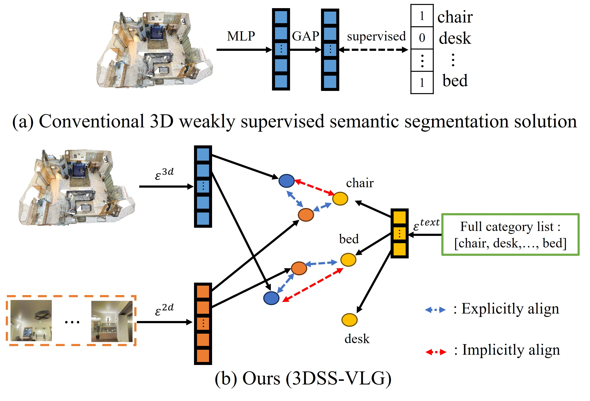

# 3DSS-VLG: 3D Weakly Supervised Semantic Segmentation with 2D Vision-Language Guidance
This repository is the offical implementation of our paper 3DSS-VLG: 3D Weakly Supervised Semantic Segmentation with 2D Vision-Language Guidance.

[[Arkiv]](https://arxiv.org/abs/2407.09826)

## Abstract

3D weakly supervised semantic segmentation aims to learn semantic segmentation without using dense annotations. Previous methods mostly use a Class Activation Map to solve this challenge. 
  In such a paradigm, the model is supervised given the scene-level or subcloud-level labels, however, remaining less-explored in the potential textually semantic information from the category labels.
  In this paper, we propose 3DSS-VLG,  a weakly supervised approach for 3D Semantic Segmentation with 2D Vision-Language Guidance, an alternative approach that a 3D model predicts dense-embedding for each point which is co-embedded with both the aligned image and text spaces from the 2D vision-language model. Specifically, our method exploits the superior generalization ability of the 2D vision-language models and proposes the Embeddings Soft-Guidance Stage to utilize it to implicitly align 3D embeddings and text embeddings. Moreover, we introduce the Embeddings Specialization Stage to purify the feature representation with the help of a given scene-level label, specifying a better feature supervised by the corresponding text embedding. Thus, the 3D model is able to gain informative supervisions both from the image embedding and text embedding, leading to competitive segmentation performances. To the best of our knowledge, this is the first work to investigate 3D weakly supervised semantic segmentation by using the textual semantic information of text category labels. Moreover, with extensive quantitative and qualitative experiments, we present that our 3DSS-VLG is able not only to achieve the state-of-the-art performance on both S3DIS and ScanNet datasets, but also to maintain strong generalization capability.



## Installation
Follow the [installation.md](installation.md) to install all required packages.

## Data Preparation

Please refer to [2D & 3D Data Preprocessing](https://github.com/pengsongyou/openscene/blob/main/scripts/preprocess/README.md) to prepare the dataset.


### Pesudo Label Generation
After you have obtained the multi-view fused embeddings, you can begin to generate the pseudo label. You can run the following to directly generate pseudo label:

```
sh sh vlm_ps_generation/generation_vlm.sh vlm_ps_generation/out_scannet/ess vlm_ps_generation/config/scannet.yaml
```
Here you should to replace 'data_root' to your scannet3d path and 'data_root_2d_fused_feature' to your multi-view fused embeddings path, save_folder to the path which you plan to save the pseudo label in the scannet.yaml.

<!-- Alternatively, we have provided the preprocessed pseudo label in the [link](). -->

### Embeddings Specialization Stage
After you have obtained the pseudo label, replace the path in the openseg_pre_train.yaml. You can train the ESS:
```
python train_openseg_pre_train.py --config config/openseg_pre_train.yaml
```

After you finish training, you can do the inference on the training dataset to obtain the indoor-aware 3D embeddings:
```
python eval_openseg_pre_train.py --config config/openseg_pre_eval.yaml
```


## Run

```
sh run/esg.sh out_scannet/openseg config/scannet/openseg_train.yaml
```

## Acknowledgement
We build some parts of our code on top of the [Openscene repository](https://github.com/pengsongyou/openscene).


## Citation
If you find our code or paper useful, please cite
```bibtex
@inproceedings{xu20243d,
  title={3d weakly supervised semantic segmentation with 2d vision-language guidance},
  author={Xu, Xiaoxu and Yuan, Yitian and Li, Jinlong and Zhang, Qiudan and Jie, Zequn and Ma, Lin and Tang, Hao and Sebe, Nicu and Wang, Xu},
  booktitle={European Conference on Computer Vision},
  pages={87--104},
  year={2024}
}
```
